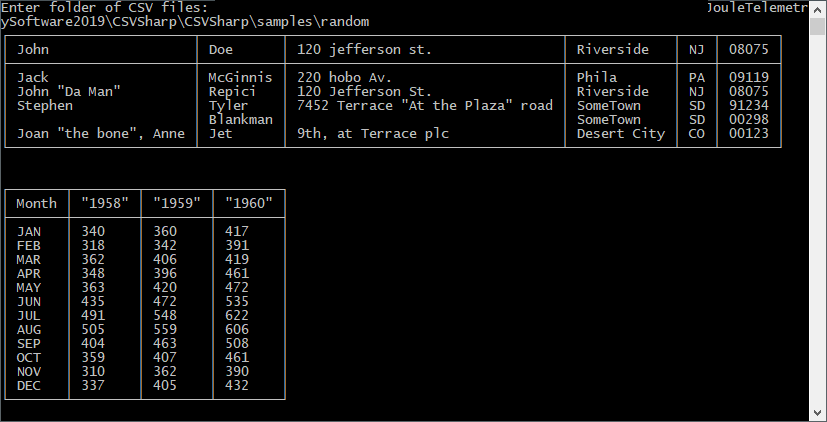

# CSVSharp

CSVSharp is a Comma-Separated Values (CSV) reader and writer that conforms to the CSV standard defined in [RFC 4180](https://tools.ietf.org/html/rfc4180). The library reads in CSV files as `DataTable` objects and can write CSV files with fields containing double quotes, newlines, and commas. Look under [Getting Started](#getting-started) below to get a demo running on your computer.

## TODO
* Fix code for unit tests

## Getting Started

These instructions will get you a copy of the project up and running on your local machine for development and testing purposes.
<!-- See deployment for notes on how to deploy the project on a live system. -->

### Prerequisites

* [Microsoft Visual Studio 2017 (MSVS 2017)](https://docs.microsoft.com/en-us/visualstudio/install/install-visual-studio?view=vs-2017) - IDE for C# (and other) applications, follow Steps 1-6
    * Install .NET Framework 4.7.2 development tools using the Visual Studio Installer

### Installing

1. Clone the GitHub repo.
2. Open the [`CSVSharp.sln`](CSVSharp.sln) file using MSVS 2017.
3. Under `Tools > NuGet Package Manager >  Manage NuGet Packages for Solution...`, ensure all packages are installed.
    * The `CSVSharp` project should have `GenericParsing` and `log4net` installed.
    * The `CSVSharpTests` project should have `MSTest.Framework` and `MSTest.Adapter` installed.
4. Ensure packages are successfully installed by:
    * running the demo [`CSVSharpSampler.cs`](CSVSharp/CSVSharpSampler.cs) using `F5` or click `Start` ([more details below](#demo)).
    * running [`CSVSharpTests.cs`](CSVSharpTests/CSVSharpTests.cs) using `Ctrl+R,A` or click `Test Explorer > Run All`.

## Demo

[`CSVSharpSampler.cs`](CSVSharp/CSVSharpSampler.cs) demonstrates the use of CSVSharp reading and writing. Use `F5` or click `Start` to run the demonstration. If your solution fails to build, refer to the [Installing](#installling) section above. Once the console program starts, you should see the prompt `Enter folder of CSV files: `. Type or paste a valid path (call it "original path") to a folder containing your CSV files. The program will parse your CSV files with `CSVReader.Read` and print out the `DataTable` to the console (Note: CSV files with too many columns may not print out properly). Press `Enter` to move to the next CSV file and output a copy of the CSV file to folder `{{original path}}/out` with `CSVWriter.Write`.

## Running the tests

Unit tests are located in [`CSVSharpTests.cs`](CSVSharpTests/CSVSharpTests.cs). Run them using `Ctrl+R,A` or click `Test Explorer > Run All`.

<!-- ### Break down into end to end tests

Explain what these tests test and why

```
Give an example
```

### And coding style tests

Explain what these tests test and why

```
Give an example
``` -->

<!-- ## Deployment

Add additional notes about how to deploy this on a live system -->

## Built With

* [GenericParser](https://www.nuget.org/packages/GenericParser)
* [PrintDataExtensions](https://www.codeproject.com/Tips/1147879/Print-DataTable-to-Console-and-more)
* [log4net](https://www.nuget.org/packages/log4net)
* [MSTest.TestFramework](https://www.nuget.org/packages/MSTest.TestFramework)
* [MSTest.TestAdapter](https://www.nuget.org/packages/MSTest.TestAdapter)

<!-- ## Contributing

Please read [CONTRIBUTING.md](https://gist.github.com/PurpleBooth/b24679402957c63ec426) for details on our code of conduct, and the process for submitting pull requests to us. -->

<!-- ## Versioning

We use [SemVer](http://semver.org/) for versioning. For the versions available, see the [tags on this repository](https://github.com/your/project/tags). -->

<!-- ## Authors

* **Billie Thompson** - *Initial work* - [PurpleBooth](https://github.com/PurpleBooth)

See also the list of [contributors](https://github.com/your/project/contributors) who participated in this project. -->

## License

This project is licensed under the MIT License - see the [LICENSE.md](LICENSE.md) file for details

<!-- ## Acknowledgments -->
